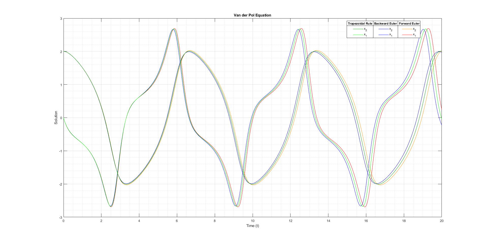

# Differential Equation Solver
A program written in Matlab that can solve any differential equation represented as a system of first order ODEs.
The program implements and computes forward Euler, backward Euler and trapezoidal rule multi-step solutions of the differential equation.

